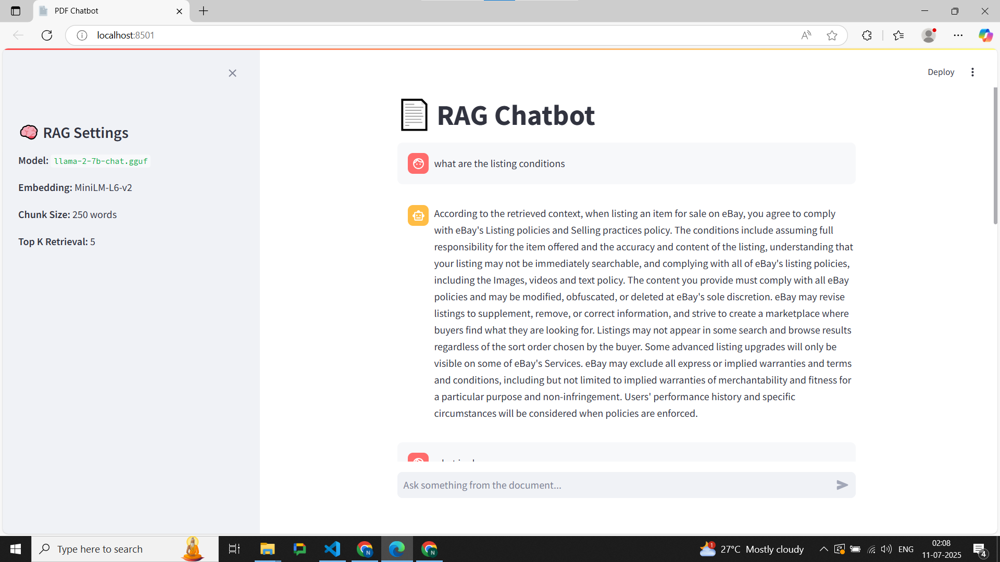
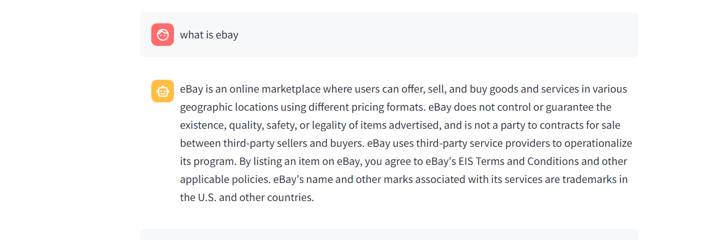
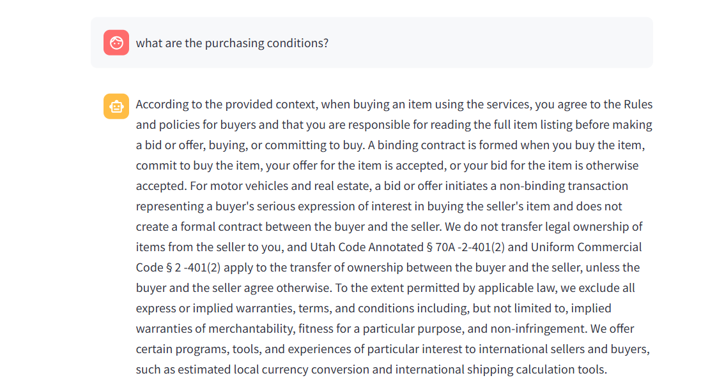

PDF RAG Chatbot – Algo

A Retrieval-Augmented Generation (RAG) chatbot built using open-source LLMs and embedding models to answer questions based strictly on the content of a provided PDF document.

Model Used: `Mistral-7B-Instruct`
Embeddings: `all-MiniLM-L6-v2`
Vector DB: `FAISS`
Interface: Streamlit with Real-Time Streaming


Mistral-7B-Instruct GGUF:
  Download from HuggingFace: [mistral-7b-instruct](https://huggingface.co/TheBloke/Mistral-7B-Instruct-v0.2-GGUF)

MiniLM Embedding Model:
  First run will auto-download and cache `sentence-transformers/all-MiniLM-L6-v2`

🧾 Prompt Design

The model uses a **strict format** to reject any query that is not supported by the provided document.

```txt
If the answer is not found in the retrieved context, respond strictly with:
"NOT RELATED TO THE PDF."
```

**Run the Application**
streamlit run app.py

Example Prompt Injection:


Demo Screenshot




## 📚 Notes

* **Embedding Model:** `all-MiniLM-L6-v2` (small & fast for CPU use)
* **LLM Used:** `Mistral-7B-Instruct` (via llama.cpp)
* **Vector Store:** FAISS (stored locally for fast lookup)
* **Chunking:** Sentence-aware with \~250 word limit per chunk

---

## 🧠 Known Limitations

*Time constraint, many more things could have been done, like bm25 and parsers like llamaparser for parsing the data in json more properly.
* Model is CPU-only; response generation may take 10–15s.
* Document must be clean PDF text (not scanned images).
